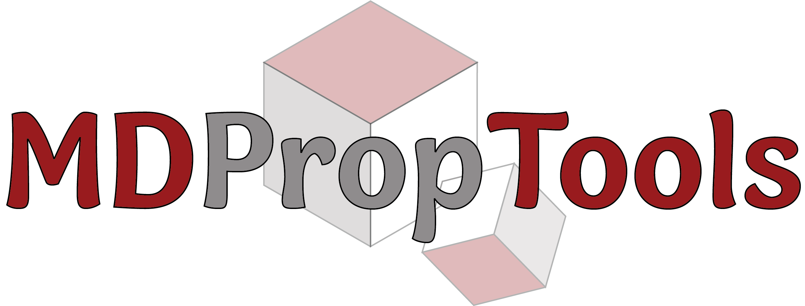

# 

# MDPropTools: MD Property Tools 

**Rasha Atwi, Matthew Bliss, Maxim Makeev, and Nav Nidhi Rajput**

**Stony Brook University** 

# Table of Contents 

# Introduction 
MDPropTools is a Python package for computing structural and dynamical properties from 
LAMMPS trajectory and output files. 

- **Source:** https://github.com/tufts-university-rajput-lab/mdproptools

# Installation

# Requirements

# Usage 
